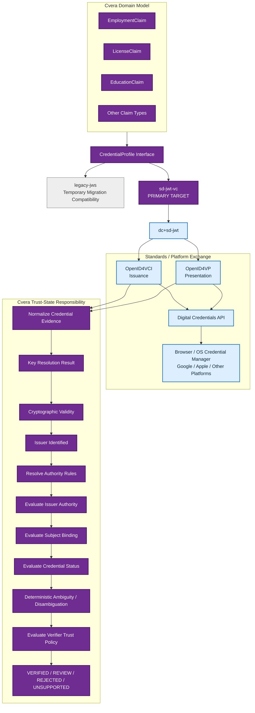

# ADR — Standards-Based Credential Architecture

### ADR-009 — Architecture Boundary Freeze

**Status:** Accepted

**Date:** 2026-09-07

**Subject:** Should Cvera continue developing proprietary credential infrastructure, or adopt established digital-credential standards while retaining Cvera-specific trust establishment and interpretation?

---

## 1. Context

Cvera is a generalized trust infrastructure platform for portable,
cryptographically verifiable claims.

Employment verification is the first implementation domain, but the
architecture is intended to support additional authoritative claim types,
including licenses, certifications, education, workforce qualifications,
compliance attestations, and other verifiable records.

The original Cvera architecture defined a substantially proprietary trust
path for attestations, including:

- an offline Root CA;
- an Issuing CA;
- issuer signing keys;
- a Cvera-defined Root CA → Issuing CA → issuer-key trust chain;
- JWS/JWKS-based attestation signing and verification;
- a Cvera-defined status/revocation list;
- Cvera-defined policy and assurance semantics; and
- planned YubiHSM2-backed Root CA operations.

Since that architecture was designed, the W3C/OpenID digital-credential
ecosystem has matured sufficiently that Cvera must distinguish between:

1. credential infrastructure that should be standardized or reused; and
2. trust capabilities that remain Cvera-specific.

A repository mapping was therefore performed before making further
credential-architecture changes.

The mapping established that the implemented MVP is materially simpler than
the full documented PKI architecture.

### 1.1 Current implemented issuance path

The current Go issuance path is:

    Employer HR response
            ↓
    EmployerAttestServerSigned()
            ↓
    AttestationSigner
            ↓
    RSA private key loaded from PEM
            ↓
    RS256 compact JWS/JWT
            ↓
    evt_requests.attestation_jws

`AttestationSigner` loads an RSA private key from PEM, derives `kid` from the
PEM filename, and signs a Cvera-specific `AttestationClaims` payload using
RS256.

The implemented signing path does not currently construct or validate the
documented Root CA → Issuing CA → issuer-key certificate chain.

### 1.2 Current implemented verification path

The TypeScript verifier currently performs:

    compact JWS
        ↓
    fetch trust artifacts
        ↓
    resolve signing key from JWKS
        ↓
    verify RS256 signature
        ↓
    validate Cvera claim shape
        ↓
    validate liveness
        ↓
    inspect custom status list
        ↓
    evaluate assurance policy
        ↓
    VALID / rejection code

The Go `/v1/verification/outcome` endpoint is already an application boundary
for verification, but the production server verifier is not yet wired into
that boundary. It currently returns a deliberately locked
`unknown / unknown` result rather than claiming successful verification.

### 1.3 Current client boundary

The Expo application does not contain a custom wallet, credential issuance
protocol, credential presentation protocol, or substantial credential
verification implementation.

Its credential-verification adapter sends a compact JWS to the server and
treats the server as authoritative for the result.

Ory Kratos email verification and authentication flows are separate from
Cvera credential verification and are not changed by this ADR.

### 1.4 Documented architecture versus implemented architecture

The repository contains specifications describing:

    Attestation JWK
        ↓
    Issuing CA
        ↓
    Root CA

and planned YubiHSM2-backed CA operations.

Root CA, Issuing CA, and YubiHSM2 concepts have been documented in architecture/specification documentation 
rather than in the current Go credential-signing runtime.

Therefore, adopting standardized credential infrastructure does not require
removing a deeply embedded production PKI implementation.

It primarily requires changing the target architecture before that
proprietary infrastructure is built further.

---

## 2. Decision

Cvera SHALL adopt a **standards-based credential architecture**.

Cvera will standardize or reuse established ecosystem mechanisms for
credential representation, cryptographic credential protection, credential
status, issuance interoperability, presentation interoperability, and
wallet/browser/platform exchange where appropriate.

Cvera SHALL NOT require its proprietary Root CA → Issuing CA hierarchy as the
general trust foundation for Cvera credentials.

Cvera SHALL retain ownership of the higher-level trust capabilities that
determine whether presented authoritative evidence is usable for a particular
verification purpose.

The architectural boundary is:

    STANDARDIZE / REUSE
    credential representation
    credential cryptographic protection
    credential status
    issuance interoperability
    presentation interoperability
    wallet/browser/platform exchange
                ↓
    CVERA
    issuer authority
    trust establishment
    subject binding
    deterministic ambiguity/disambiguation
    trust-policy interpretation
    verification outcome semantics
    audit / receipts
    commercial API / metering / billing
    vertical workflows

This ADR freezes that boundary.

It does **not** freeze every implementation profile used within the standards
layer.

---

## 3. Architectural Principle

The target architecture separates three distinct questions.

### 3.1 Cryptographic validity

Can the presented credential and its cryptographic proof be successfully
validated using its supported credential security mechanism?

This is primarily a standardized credential-infrastructure concern.

### 3.2 Issuer authority and trust establishment

Who issued the claim?

Is the issuer recognized?

Is that issuer authoritative for this claim type and context?

Is the claim bound appropriately to the subject?

Is its current status acceptable?

These remain Cvera trust-establishment concerns.

### 3.3 Trust interpretation and reliance

Is this authoritative evidence sufficient for this verifier, purpose, risk
tier, and policy?

This remains a Cvera trust-interpretation concern.

Therefore:

    cryptographically valid
            ≠
    authoritative for the claim
            ≠
    acceptable under verifier policy

A cryptographically valid credential does not by itself produce a Cvera
`VERIFIED` decision.

---

## 4. Standards Boundary

### 4.1 ADOPT STANDARD / REUSE

Cvera SHALL prefer established standards over proprietary mechanisms for:

- interoperable credential representation;
- credential cryptographic protection;
- credential status and revocation/suspension mechanisms;
- credential issuance interoperability;
- credential presentation interoperability; and
- compatible wallet/credential-manager exchange.

The standards ecosystem currently relevant to this direction includes:

- W3C Verifiable Credentials Data Model 2.0;
- SD-JWT VC is the primary migration profile;
- standardized credential-status mechanisms;
- OpenID for Verifiable Credential Issuance (OpenID4VCI);
- OpenID for Verifiable Presentations (OpenID4VP); and
- W3C Digital Credentials API where appropriate and sufficiently supported.

This list establishes architectural direction, not a frozen implementation
profile.

### 4.2 INTEROPERATE

Cvera SHALL place platform-specific and exchange-specific mechanisms behind
architectural boundaries or adapters where practical.

This particularly applies to:

- Digital Credentials API integration;
- browser integration;
- operating-system credential managers;
- third-party wallets;
- cross-device presentation mechanisms; and
- future compatible presentation channels.

Cvera's core trust engine SHALL NOT depend directly on one wallet, browser,
credential manager, or user-agent API.

### 4.3 KEEP / DIFFERENTIATE

The following remain Cvera-owned capabilities:

- issuer onboarding and authority;
- authoritative claim semantics;
- trust establishment;
- subject binding;
- claim lifecycle semantics above credential transport;
- deterministic ambiguity/disambiguation;
- verifier-specific trust policy;
- trust-policy interpretation;
- verification decision semantics;
- verification receipts and audit semantics;
- commercial API behavior;
- metering and billing;
- network economics; and
- vertical/domain workflows.

These capabilities SHALL operate on normalized evidence rather than depend
unnecessarily on one credential encoding or presentation protocol.

### 4.4 SIMPLIFY / RETIRE

The following SHALL NOT remain mandatory components of the generalized Cvera
credential architecture:

- proprietary Cvera Root CA as the universal credential trust anchor;
- proprietary Cvera Issuing CA as a required credential layer;
- mandatory Root CA → Issuing CA → issuer-key trust-chain validation;
- YubiHSM2 as the foundational trust anchor for the Cvera platform;
- Cvera's custom status-list representation as the target-state credential
  status mechanism; and
- proprietary general-purpose credential issuance or presentation protocols
  where established interoperable standards satisfy the requirement.

These components MAY remain temporarily during migration or MAY remain
available in the future as optional high-assurance/private-PKI mechanisms if
a concrete requirement justifies them.

They are not the default generalized architecture.

---

## 5. Component Decisions

### 5.1 Offline Root CA

**Decision:** RETIRE AS MANDATORY CORE ARCHITECTURE.

Cvera SHALL NOT require all supported credentials or issuers to derive trust
from a proprietary Cvera offline Root CA.

This does not prohibit private PKI or certificate-based trust from being
supported by a future profile where justified.

### 5.2 Issuing CA

**Decision:** RETIRE AS MANDATORY CORE ARCHITECTURE.

A Cvera-controlled Issuing CA SHALL NOT be a prerequisite for general
credential interoperability.

### 5.3 Issuer Signing Keys

**Decision:** KEEP CONCEPT; STANDARDIZE IMPLEMENTATION.

Credential issuers still require cryptographic signing/proof capability.

Cvera SHALL use the signing, verification-key, and identifier mechanisms
selected by the supported credential profile rather than assume that issuer
authority is established solely by membership in Cvera's proprietary PKI.

### 5.4 YubiHSM2

**Decision:** RETIRE AS FOUNDATIONAL TRUST REQUIREMENT; RETAIN AS OPTIONAL
KEY-PROTECTION TECHNOLOGY.

Hardware-backed key protection remains potentially valuable for issuer,
service, receipt, CA, or other high-assurance signing keys.

The existence of an HSM does not itself define Cvera's trust architecture.

### 5.5 Custom Trust-Chain Validation

**Decision:** RETIRE AS GENERALIZED MANDATORY TRUST MECHANISM.

Cvera SHALL separate:

    cryptographic proof/key validation

from:

    issuer authority determination

from:

    verifier trust-policy evaluation

A valid cryptographic chain or proof SHALL NOT, by itself, mean that the
issuer is authoritative for a claim or that a verifier should rely upon it.

### 5.6 JWKS

**Decision:** INTEROPERATE / SIMPLIFY.

JWKS MAY remain an appropriate mechanism under supported credential/security
profiles.

However, possession of a key in a Cvera-published JWKS SHALL NOT itself be
the complete definition of issuer authority.

Key resolution and issuer authority SHALL remain distinct concepts.

### 5.7 Credential Status / Revocation

**Decision:** ADOPT STANDARD; RETIRE CUSTOM FORMAT AS TARGET STATE.

The current Cvera `statuslist.json` implementation MAY remain during
migration and compatibility testing.

Target-state credential status SHOULD use the selected standardized
credential-status mechanism.

Cvera policy MAY still determine how particular status conditions affect a
verification decision.

### 5.8 Current Compact JWS Attestation

**Decision:** MIGRATE THROUGH AN ADAPTER; EVENTUALLY RETIRE AS THE SOLE
CREDENTIAL FORMAT.

The existing compact RS256 JWS is a functioning MVP credential artifact and
SHALL NOT be destructively removed before replacement functionality is
validated.

Cvera domain claims SHALL be separated from their credential encoding so that
the same domain model can be mapped into supported standardized credential
representations.

Conceptually:

    Cvera domain claim
            ↓
    credential representation adapter
            ├── legacy JWS
            └── standards-based credential profile

The legacy path MAY remain during equivalence testing and migration.

### 5.9 Trust Policy

**Decision:** KEEP / DIFFERENTIATE.

Verifier-specific policy is not delegated to the credential transport layer.

Cvera SHALL continue to support policy interpretation over authoritative
evidence, including concepts such as:

- claim applicability;
- risk tier;
- recency;
- assurance requirements;
- issuer requirements;
- ambiguity thresholds;
- required evidence;
- review conditions;
- rejection conditions; and
- audit/receipt requirements.

Policy models MAY evolve independently of credential representation.

### 5.10 Deterministic Ambiguity / Disambiguation

**Decision:** KEEP / DIFFERENTIATE.

Deterministic ambiguity and disambiguation operate above credential
cryptographic validity.

The relevant Cvera protocol SHALL evolve toward credential-format-neutral
inputs rather than being intrinsically tied to the legacy attestation JWS.

### 5.11 Verification Outcome Semantics

**Decision:** KEEP / DIFFERENTIATE.

Cvera SHALL distinguish low-level credential-validation results from
higher-level trust decisions.

The target conceptual pipeline is:

    presented evidence
            ↓
    credential validation
            ↓
    issuer authority
            ↓
    subject binding
            ↓
    current status
            ↓
    trust-policy evaluation
            ↓
    Cvera decision
            ↓
    VERIFIED / REVIEW / REJECTED / UNSUPPORTED

The exact external and internal outcome schemas MAY evolve independently.

---

## 6. Target Architecture

The target architecture is:

---
*Figure 1 — Target credential architecture. Cvera domain claims remain
independent of credential serialization; SD-JWT VC (`dc+sd-jwt`) is the
primary standards migration target, while the legacy JWS path remains
temporarily available for migration compatibility.*

## 7. Profile-Level Decisions

SD-JWT VC (`dc+sd-jwt`) has been selected as Cvera's primary standards
migration credential profile.

Until the corresponding IETF specification reaches final publication,
implementation SHALL target a pinned specification version and SHALL remain
isolated behind the `CredentialProfile` boundary so that specification
changes do not propagate into Cvera domain or trust semantics.

This decision does not make SD-JWT VC the Cvera domain model and does not
prevent Cvera from supporting additional credential profiles.

The following implementation-profile decisions remain unresolved:

- exact VC credential representation/profile;
- exact credential securing/proof mechanism;
- exact cryptographic algorithms;
- issuer identifier mechanism;
- issuer verification-key resolution mechanism;
- credential schema/profile conventions;
- exact standardized credential-status profile;
- exact OpenID4VCI profile and options;
- exact OpenID4VP profile and options;
- wallet or credential-manager providers;
- native/mobile wallet integration;
- browser presentation implementation;
- exact Digital Credentials API integration;
- cross-device presentation mechanics;
- QR use and fallback behavior;
- hardware-backed key-protection provider;
- KMS/HSM selection;
- high-assurance/private-PKI support; and
- migration cutover/versioning mechanics.

These decisions MUST conform to the architectural boundary established by this
ADR unless a later ADR explicitly supersedes it.

This prevents premature commitment to one ecosystem implementation while
avoiding further investment in proprietary infrastructure that standards can
supply.

---

## 8. Migration Constraints

This ADR defines target architecture. It does not authorize destructive
migration without equivalence testing.

The migration SHALL follow these constraints:

1. Existing working MVP workflows remain functional during migration.
2. Current JWS issuance MAY remain as a legacy implementation.
3. Existing database fields MAY remain until replacement data models are
   proven.
4. Credential-format-specific logic SHOULD move behind adapters.
5. The server remains authoritative for trust evaluation.
6. Expo SHALL NOT become the authoritative trust-verification engine.
7. Authentication architecture, including Ory Kratos, remains separate from
   credential architecture.
8. Standards adoption SHALL NOT collapse cryptographic validity, issuer
   authority, and verifier policy into one trust decision.
9. Legacy infrastructure SHALL be removed only after replacement behavior has
   been tested and the migration path is understood.
10. New credential infrastructure SHOULD target the standards-based
    architecture rather than extend the proprietary PKI path.

---

## 9. Consequences (Accepted)

### Positive

- Cvera avoids building general-purpose credential infrastructure already
  addressed by established standards.
- Founder engineering effort can move higher in the trust stack.
- Cvera becomes capable of consuming interoperable credential evidence rather
  than requiring universal adoption of a proprietary credential format.
- Wallet, browser, and credential-manager interoperability can evolve without
  redefining Cvera's trust engine.
- Issuer authority becomes explicitly separate from cryptographic key
  possession.
- Trust policy remains independently re-evaluable.
- The current MVP requires substantially less destructive migration because
  the full proprietary PKI architecture has not been deeply embedded in the
  live signing path.
- Existing JWS functionality can provide a compatibility baseline during
  migration.

### Negative / Cost

- Cvera must implement and test standards adapters.
- Credential normalization becomes an explicit architectural responsibility.
- Standards and platform implementations may evolve at different rates.
- Multiple credential/security profiles may eventually need support.
- Interoperability testing becomes necessary.
- Some existing specifications will require revision or supersession.
- Cvera must maintain clear boundaries between standards-derived validation
  and Cvera-derived trust decisions.

### Accepted uncertainty

This ADR deliberately leaves implementation-profile choices unresolved.

The architectural decision does not depend on knowing today which wallet,
credential proof profile, identifier method, key-resolution method, or
Digital Credentials API integration will ultimately dominate.

---

## 10. Superseded Architectural Assumptions

This ADR supersedes the assumption that generalized Cvera credential trust
requires:

    Cvera Root CA
        ↓
    Cvera Issuing CA
        ↓
    approved issuer/attestation key
        ↓
    JWS credential

as the mandatory trust path.

In particular, the mandatory proprietary-PKI assumptions contained in
documents such as:

- `specs/PH-1-EVT/TP-1-Trust-Path-Spec.md`;
- `specs/PH-1-EVT/CP-CPS-v1.md`;
- `docs/PH-2-EVT/PH-2.requestor-lifecycle.md`; and
- historical architecture described in `docs/pre-wedge-README.md`

are superseded where they conflict with this ADR.

Those documents SHALL NOT be interpreted as requiring new implementation of
the proprietary Root CA / Issuing CA hierarchy for the generalized
standards-based credential architecture.

They remain useful historical and technical references.

Security, governance, assurance, key-lifecycle, audit, issuer-control, and
other concepts within those documents are NOT automatically superseded merely
because their original PKI realization is no longer mandatory.

The following architectural areas are specifically preserved:

- issuer authority;
- subject binding;
- deterministic disambiguation;
- trust-policy interpretation;
- verification semantics; and
- claim-domain protocols,

subject to future revisions required to make them credential-format-neutral.

---

## 11. Architecture Freeze / Change Control

**This ADR establishes the frozen target architectural boundary for Cvera's
credential infrastructure.**

All new credential architecture and implementation MUST conform to the
following separation:

    standards establish interoperable credential evidence
                        ↓
    Cvera establishes authority and trust
                        ↓
    Cvera interprets evidence under verifier policy
                        ↓
    Cvera produces a decision

Existing legacy implementation MAY remain temporarily for compatibility,
migration, and equivalence testing.

Implementation-profile decisions MAY be made in subordinate ADRs without
superseding this ADR provided they remain within this boundary.

A material architectural change that causes Cvera to:

- recreate proprietary general-purpose credential infrastructure in place of
  suitable standards;
- make a proprietary Cvera Root/Issuing CA mandatory again;
- delegate Cvera issuer-authority determination to credential signature
  validity alone;
- delegate verifier-specific trust interpretation to the credential format;
  or
- otherwise collapse the separation established by this ADR

requires a subsequent ADR explicitly superseding ADR-009.

---

## 12. Guiding Architecture Statement

The architecture is summarized as:

> **Standards move credentials. Cvera establishes and interprets trust.**

More precisely:

> **Standardized credential infrastructure establishes interoperable,
> cryptographically verifiable evidence. Cvera determines whether that
> evidence is authoritative, appropriately bound, current, sufficient under
> verifier policy, and usable for a specific trust decision.**

This separation is the architectural foundation for subsequent Cvera
credential development.

---