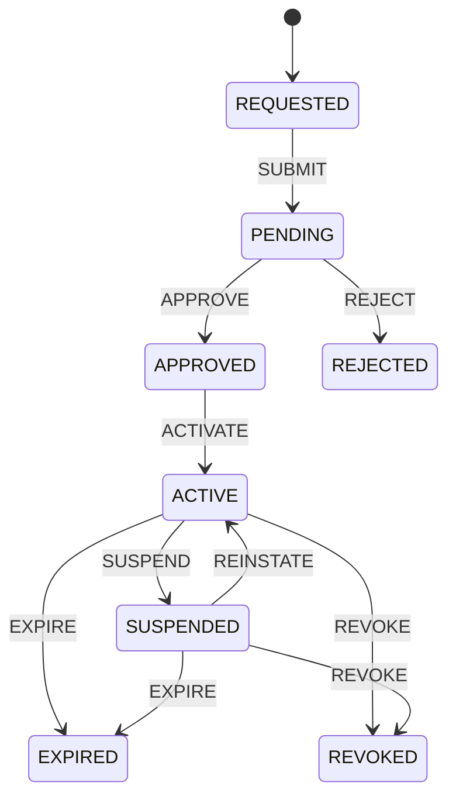

# Cvera Authority Establishment State Machine

**Status:** Accepted

**Version:** 1.0

**Date:** 2026-10-04

**Subject:** Canonical lifecycle and transition semantics for establishing, activating, suspending, reinstating, expiring, rejecting, and revoking issuer authority in Cvera.

---

## 1. Purpose

Cvera requires a deterministic mechanism for establishing and maintaining
whether an identified issuer is entitled to assert a defined claim type on
behalf of an authority subject.

For the employment domain, the fundamental authority question is:

> Is issuer X authorized to assert `employment.role` claims on behalf of
> employer Y?

Cryptographic key resolution does not answer this question.

Key resolution establishes whether an entity controls the cryptographic
issuer identity used to make an assertion. Authority establishment determines
whether that issuer is entitled to make the assertion represented by the
claim.

Cvera therefore models authority establishment as an explicit state machine:

    (Current State, Event, Conditions/Evidence) → Next State

A transition occurs only when the event is permitted from the current state
and all required conditions for that transition have been established.

This specification defines the canonical authority-establishment lifecycle.
It does not define storage, HTTP APIs, user-interface flows, or a particular
organizational identity-proofing mechanism.

---

## 2. Architectural Boundary

Authority establishment is distinct from credential cryptographic
verification and verifier reliance policy.

The architecture is:

    Presented Credential
            ↓
    Credential Profile / Cryptographic Verification
            ↓
    NormalizedCredentialEvidence
            ↓
    Authority Establishment / Authority Evidence
            ↓
    AuthorityGrantResolver
            ↓
    AuthorityEvaluator
            ↓
    AUTHORIZED / UNAUTHORIZED / REVIEW
            ↓
    Verifier Trust Policy
            ↓
    Final Cvera Decision

The following questions MUST remain separate:

1. **Cryptographic control** — does the issuer control the cryptographic
   identity used to issue the credential?
2. **Issuer authority** — is that issuer entitled to assert this claim type
   on behalf of this authority subject?
3. **Verifier reliance** — is the resulting authoritative evidence sufficient
   for the verifier's purpose and policy?

Therefore:

    cryptographic validity
            ≠
    issuer authority
            ≠
    verifier reliance

An ACTIVE authority does not by itself produce a Cvera `VERIFIED` decision.

---

## 3. Authority Scope

An authorization MUST bind, at minimum:

- an identified issuer;
- a claim type; and
- an identified authority subject.

For the initial employment implementation:

    IssuerID
    ClaimType = employment.role
    AuthoritySubjectID = employer identifier

These dimensions correspond to the authority-evaluation question:

> Is this issuer entitled to assert this claim type on behalf of this
> authority subject?

Authority establishment MUST NOT be inferred solely from:

- possession of a signing key;
- successful credential signature verification;
- existence of an issuer account;
- issuer metadata;
- domain ownership;
- JWKS membership; or
- cryptographic key resolution.

Such evidence may establish identity or cryptographic control, but does not
alone establish entitlement to make the claim.

---

## 4. Canonical States

### 4.1 REQUESTED

An authorization lifecycle has been created, but has not yet been submitted
for organizational consideration.

No issuer authority exists.

### 4.2 PENDING

The authorization request has been submitted and is awaiting an authoritative
organizational decision.

No issuer authority exists.

### 4.3 APPROVED

The relevant organization has affirmatively authorized the issuer and claim
scope.

Organizational consent exists, but the authorization is not yet technically
active and MUST NOT yet be treated as exercisable authority.

### 4.4 ACTIVE

Organizational approval has been successfully bound to the required issuer,
authority subject, and claim scope, and all activation prerequisites have
been satisfied.

The authorization may supply current authority evidence to Cvera's authority
evaluation layer.

### 4.5 SUSPENDED

Previously active authority has been temporarily disabled.

The authorization remains historically valid but MUST NOT supply current
positive authority while suspended.

A suspended authorization may be reinstated if the conditions permitting
reinstatement are satisfied.

### 4.6 REJECTED

The authorization request was rejected before authority became active.

Authority was never granted.

REJECTED is terminal for this authorization lifecycle.

### 4.7 EXPIRED

The authorization's permitted validity period has ended.

EXPIRED is terminal for this authorization lifecycle.

### 4.8 REVOKED

Previously granted authority has been permanently withdrawn for this specific
authorization.

REVOKED is terminal for this authorization lifecycle.

Revocation of one authorization does not prohibit the parties from
establishing a new authorization through a new lifecycle.

---

## 5. Canonical Events

The authority-establishment state machine recognizes the following events:

- `SUBMIT`
- `APPROVE`
- `REJECT`
- `ACTIVATE`
- `SUSPEND`
- `REINSTATE`
- `EXPIRE`
- `REVOKE`

Event names are canonical within this specification.

`REINSTATE` is used rather than `RESUME` because returning suspended
authority to ACTIVE requires an affirmative authorization decision after the
suspension condition has been resolved.

---

## 6. Canonical Transition Table

Only the transitions in this table are permitted.

| Current State | Event | Required Conditions / Evidence | Next State |
|---|---|---|---|
| REQUESTED | SUBMIT | Authorization request identifies the issuer, authority subject, and requested claim scope; required request information is complete enough for authoritative review. | PENDING |
| PENDING | APPROVE | Approving organization identity is established; approving actor is authorized to act for that organization; issuer identity is identified; authority subject is identified; requested claim type/scope is explicitly approved; approval is attributable to the approving organization and auditable. | APPROVED |
| PENDING | REJECT | Rejecting actor is authorized to act for the organization considering the request; rejection is attributable and auditable. | REJECTED |
| APPROVED | ACTIVATE | Approval remains valid; approved issuer identity is bound to the authorization; authority subject is bound to the authorization; approved claim type/scope is bound to the authorization; required activation prerequisites are satisfied; sufficient information exists to construct deterministic authority evidence. | ACTIVE |
| ACTIVE | SUSPEND | Actor or system initiating suspension is authorized to do so under Cvera authority policy; suspension reason is established and auditable; suspension applies to this authorization. | SUSPENDED |
| SUSPENDED | REINSTATE | Condition causing suspension has been resolved or otherwise cleared; reinstatement is authorized; original authorization remains otherwise valid; reinstatement decision is attributable and auditable. | ACTIVE |
| ACTIVE | EXPIRE | The authorization has reached the end of its permitted validity period according to its authoritative temporal bounds. | EXPIRED |
| SUSPENDED | EXPIRE | The authorization has reached the end of its permitted validity period while suspended. | EXPIRED |
| ACTIVE | REVOKE | An actor or authority entitled to withdraw the authorization has done so; withdrawal applies to this authorization and is attributable and auditable. | REVOKED |
| SUSPENDED | REVOKE | An actor or authority entitled to withdraw the authorization has done so while the authorization is suspended; withdrawal applies to this authorization and is attributable and auditable. | REVOKED |

---

## 7. APPROVED and ACTIVE Are Deliberately Distinct

`APPROVED` and `ACTIVE` represent different real-world facts and MUST remain
separate states.

### APPROVED establishes organizational authorization

At APPROVED:

- the organization has consented to the issuer asserting the approved claim
  scope on its behalf;
- the approval is attributable to an authorized organizational actor; and
- the approved authority scope is known.

However, organizational approval alone does not make authority technically
exercisable.

### ACTIVATE establishes enforceable binding

ACTIVATE confirms that the organizational authorization has been bound to the
identities and scope required by Cvera's authority system.

At minimum, activation establishes the binding among:

    approved issuer
          +
    approved claim type/scope
          +
    authority subject
          ↓
    ACTIVE authorization

Only after successful ACTIVATE may the authorization supply positive current
authority evidence.

---

## 8. Suspension and Reinstatement

Suspension is temporary.

`SUSPEND` MUST NOT destroy the historical authorization or create a new
authorization lifecycle.

While SUSPENDED:

- the authorization MUST NOT provide positive current authority;
- its historical identity and approval remain associated with the same
  authorization;
- it may expire;
- it may be revoked; and
- it may return to ACTIVE only through `REINSTATE`.

`REINSTATE` restores the same authorization.

It MUST NOT create a new grant merely because authority was temporarily
suspended.

A reinstatement decision MUST establish that the suspension condition has
been resolved or otherwise authoritatively cleared and that the underlying
authorization remains valid.

---

## 9. Terminal States

The terminal states are:

- REJECTED
- EXPIRED
- REVOKED

No transition out of a terminal state is permitted.

### 9.1 Rejected authorization

A rejected authorization never established authority.

A later authorization attempt MUST begin a new authorization lifecycle.

### 9.2 Expired authorization

An expired authorization cannot be reactivated or reinstated.

A later authorization MUST begin a new authorization lifecycle.

### 9.3 Revoked authorization

Revocation permanently terminates that specific authorization.

A revoked authorization MUST NOT transition back to ACTIVE, APPROVED,
PENDING, or REQUESTED.

A future authorization between the same issuer and authority subject for the
same claim type is permitted only as a new authorization lifecycle with a
distinct authorization identity.

---

## 10. Negative Space and Invalid Transitions

The transition table in Section 6 defines the complete positive space.

Any `(Current State, Event)` combination not explicitly defined there is an
invalid transition.

Examples include:

    REQUESTED + ACTIVATE
    PENDING + ACTIVATE
    APPROVED + REINSTATE
    ACTIVE + APPROVE
    SUSPENDED + ACTIVATE
    REJECTED + APPROVE
    EXPIRED + REINSTATE
    REVOKED + REINSTATE
    REVOKED + ACTIVATE

An implementation MUST fail closed for invalid transitions.

An invalid transition MUST NOT mutate authority state.

The implementation SHOULD expose a deterministic reason identifying that the
event is not permitted from the current state.

---

## 11. Relationship to AuthorityGrant

The authority-establishment lifecycle and `AuthorityGrant` are related but
are not the same abstraction.

The lifecycle answers:

> What is the current status of this authorization, and how did it reach that
> status?

`AuthorityGrant` supplies machine-readable authority evidence to the
authority-evaluation layer.

The existing authority evaluator answers:

> Given normalized credential evidence and resolved authority grants, is
> there sufficient current authority evidence for this issuer, claim type,
> and authority subject?

The state machine MUST NOT directly produce a final verifier decision.

Conceptually:

    Authority Authorization Lifecycle
                ↓
        current authority evidence
                ↓
          AuthorityGrant
                ↓
      AuthorityGrantResolver
                ↓
       AuthorityEvaluator
                ↓
    AUTHORIZED / UNAUTHORIZED / REVIEW

The exact persistence and projection mechanism by which lifecycle state is
represented as resolver-visible `AuthorityGrant` evidence is outside the
scope of this specification and MUST be defined separately before
integration.

---

## 12. Relationship to Existing Authority Evaluation Semantics

The existing authority evaluator defines:

- `AUTHORIZED`
- `UNAUTHORIZED`
- `REVIEW`

Those are evaluation decisions, not lifecycle states.

They MUST NOT be used as substitutes for:

- APPROVED;
- ACTIVE;
- SUSPENDED;
- REJECTED;
- EXPIRED; or
- REVOKED.

Likewise, lifecycle state MUST NOT be treated as a final Cvera verification
decision.

In particular:

    ACTIVE ≠ VERIFIED
    APPROVED ≠ AUTHORIZED
    cryptographically valid ≠ ACTIVE

The mapping between lifecycle state and resolver-visible authority evidence
MUST preserve these boundaries.

---

## 13. Evidence Requirements and Mechanism Boundary

This specification defines what each transition must establish.

It deliberately does not yet prescribe every mechanism by which the required
evidence is obtained.

For example, APPROVE requires Cvera to establish that:

- the approving organization is the relevant authority subject or is
  otherwise entitled to grant the requested authority;
- the approving actor is authorized to act for that organization;
- the issuer and requested claim scope are known; and
- the approval is attributable and auditable.

This specification does not yet mandate whether those facts are established
through a particular enterprise administrator workflow, organizational
identity-proofing process, signed authorization artifact, external registry,
contractual integration, or another approved mechanism.

Those mechanisms may evolve without changing the state-machine semantics,
provided they satisfy the conditions frozen here.

This separation prevents authority-establishment semantics from becoming
coupled prematurely to one onboarding, storage, identity, or API design.

---

## 14. Auditability and Determinism

Every successful transition MUST be attributable to:

- the authorization being changed;
- the prior state;
- the triggering event;
- the resulting state;
- the time of transition;
- the conditions/evidence used to permit the transition; and
- the responsible actor or authoritative system where applicable.

Given the same authoritative prior state, event, and accepted conditions, the
state-machine decision MUST be deterministic.

Historical transitions MUST remain distinguishable from current authority.

Audit history MUST NOT itself imply that authority remains current.

---

## 15. Core Invariants

The following invariants are frozen:

1. Key resolution and issuer authority are separate evaluations.
2. Organizational approval and technical activation are separate events.
3. No positive current authority exists before ACTIVE.
4. Only explicitly permitted transitions may mutate lifecycle state.
5. REJECTED means authority was never granted.
6. SUSPENDED means previously active authority is temporarily unusable.
7. REINSTATE restores the same suspended authorization.
8. EXPIRED is terminal for the authorization.
9. REVOKED is terminal for the authorization.
10. A future authorization after REJECTED, EXPIRED, or REVOKED requires a new
    lifecycle.
11. ACTIVE authority does not imply verifier reliance or `VERIFIED`.
12. Authority state MUST NOT be inferred solely from cryptographic key
    control.
13. Transition decisions and their supporting evidence MUST be auditable.
14. State-machine behavior MUST be deterministic.

---

## 16. Out of Scope

This specification does not define:

- database schema or persistence;
- HTTP/API endpoints;
- user-interface workflow;
- organizational identity-proofing implementation;
- administrator authentication implementation;
- storage format for transition evidence;
- credential issuance protocols;
- credential presentation protocols;
- cryptographic key-resolution mechanisms;
- verifier-specific trust policy;
- final Cvera verification outcomes;
- commercial API behavior;
- billing or metering; or
- the implementation language representation of the state machine.

These concerns MUST NOT be introduced into the first pure state-machine
implementation unless separately specified.

---

## 17. Implementation Contract

The first implementation derived from this specification SHOULD be a pure,
deterministic state-transition component.

Its responsibility is limited to evaluating:

    Current State
        +
    Event
        +
    Transition Conditions
        ↓
    Transition Decision
        +
    Next State

The implementation MUST:

- represent the canonical states and events defined here;
- permit every transition defined in Section 6 when its required conditions
  are satisfied;
- reject transitions whose required conditions are not satisfied;
- reject every transition outside the positive-space table;
- preserve the prior state when a transition is rejected;
- treat terminal states as terminal; and
- behave deterministically.

Persistence, API orchestration, organizational proofing, and integration with
`AuthorityGrantResolver` are separate implementation slices.

---

## 18. Controlled Architecture Amendments

This specification is a frozen architectural baseline, not an assertion that
future evidence can never justify change.

A material change to:

- canonical states;
- canonical events;
- permitted transitions;
- terminal-state semantics;
- required transition conditions;
- authority-scope semantics; or
- the boundary between lifecycle state and authority evaluation

requires an explicit specification amendment.

Amendments MUST:

1. identify the existing rule being changed;
2. state the reason for the change;
3. describe affected transitions and invariants;
4. identify implementation/tests affected by the change;
5. increment the specification version; and
6. re-freeze the amended specification before implementation behavior is
   changed.

For example:

    v1.0 → v1.1

Minor editorial clarification that does not change state-machine semantics
does not require a semantic version increment.

Architecture changes MUST NOT be introduced implicitly through implementation
code.

---

## 19. Frozen Decision

Cvera SHALL use the authority-establishment state machine defined by this
specification as the canonical lifecycle for issuer authorization.

The canonical model is:

REJECTED, EXPIRED, and REVOKED are terminal for the authorization lifecycle.

This specification defines the implementation contract for subsequent
authority-establishment state-machine work.
