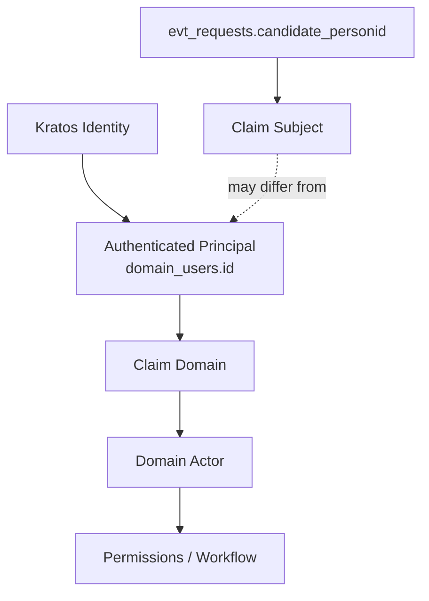
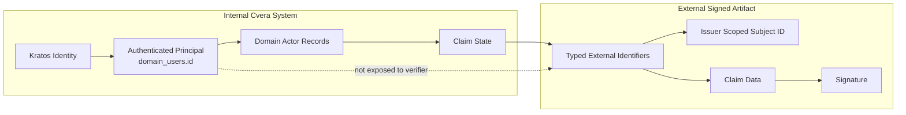

# Cvera Subject Identifier Architecture Proposal

**Status:** Draft  
**Audience:** Internal architecture review  
**Repository Location:** `docs/architecture/subject-identifier-proposal.md`

## Review Participants

- Identity architecture advisor
- Distributed systems / state-machine review
- Product engineering
- Trust infrastructure review

---

# 1. Purpose

This document proposes the initial subject identifier architecture for Cvera.

The objective is to establish a stable internal subject reference model while minimizing premature commitments to globally resolvable identity systems, decentralized identifier methods (DIDs), or publicly correlatable subject identifiers.

This proposal is intended to support:

- verifiable claims portability
- issuer-scoped subject representation
- privacy-conscious verification
- future W3C Verifiable Credentials alignment
- future DID compatibility
- blind-search-compatible verification models

without introducing unnecessary complexity into the MVP.

---

# 2. Problem Statement

The MVP currently uses email-based subject identifiers:

```json
{
  "subject": {
    "identifier": "mailto:user@example.com"
  }
}
```

This creates several architectural concerns:

- email is mutable
- email is contextual
- email is correlatable
- email may expose unnecessary personal information
- email conflates account identity, contact method, and credential subject identity
- email is unsuitable as a long-term persistence anchor

The system therefore requires a stable internal subject abstraction.

---

# 3. Proposed Internal Subject Identifier

Cvera introduces an internal subject identifier with the following structure:

```text
domain_users.kratos_identity_id
```

## Example

```text
domain_users.01J8YQZ7X5J6K2R9M4N8P1T3V6
```

## Structure Breakdown

| Component | Meaning |
|---|---|
| `sid` | subject identifier prefix |
| `_` | separator |
| `ULID` | globally unique sortable identifier |

The identifier is:

- opaque
- non-semantic
- non-sequential
- internal-only
- stable across claim records

The identifier is **NOT**:

- a DID
- a public subject identifier
- a wallet identifier
- an email address
- a verifier lookup key
- a universal identity layer

---

# 4. Principal vs Claim Subject Boundary

Cvera distinguishes between:

- authentication identity
- authenticated application principal
- domain actor authority
- claim-subject identity

These concepts must not be conflated.

The authenticated principal establishes:
- who authenticated
- who owns the application session
- who may act within one or more claim domains

However, the authenticated principal is not automatically equivalent to the subject of every verifiable claim workflow.

Examples:

- an HR reviewer may authenticate and verify a claim about a candidate
- a recruiter may verify a claim about another individual
- a delegate may eventually act on behalf of another subject
- future legal or medical workflows may separate subject and authenticated principal entirely

This separation is necessary to avoid coupling:
- authentication
- authorization
- workflow authority
- claim-subject semantics

---

# 5. Internal Subject Representation

## Example

```json
{
  "subject": {
    "internal_ref": "sid_01J8YQZ7X5J6K2R9M4N8P1T3V6",
    "exposure": "internal_only"
  }
}
```

## Reference Artifact

```text
docs/examples/subject-identifier.internal.json
```
---


---

# 5. External Subject Representation

External signed artifacts should avoid exposing the internal subject identifier directly.

External identifiers should instead be:

- typed
- contextual
- issuer-scoped where possible

## Example

```json
{
  "subject": {
    "identifiers": [
      {
        "type": "issuer_scoped_subject_id",
        "scope": "issuer:emp_demo_001",
        "value": "employee-74291"
      }
    ]
  }
}
```

## Reference Artifact

```text
docs/examples/subject-identifier.external.json
```

---

# 5. Privacy Position

This proposal intentionally separates:

- internal persistence identity
- credential subject representation
- contact methods
- account identity
- verifier-facing identifiers

The proposal avoids creating:

- globally reusable public subject identifiers
- centralized subject discovery mechanisms
- verifier-searchable person indexes

Verification should rely on:

- issuer authority
- signatures
- revocation status
- trust policy
- claim validity

rather than universal subject lookup.

---

# 6. W3C / VC Alignment

This proposal follows:

- W3C VC normative requirements where applicable
- non-normative implementation guidance regarding identifier privacy and extensibility

This proposal does not currently require:

- DID adoption
- DID method selection
- wallet binding
- pairwise identifiers
- selective disclosure protocols

However, the design is intended to remain compatible with future evolution toward those models.

---

# 7. Current Decisions

| Decision | Status |
|---|---|
| Internal subject identifier prefix = `sid` | Accepted |
| Unique ID format = ULID | Accepted |
| Visibility = internal-only | Accepted |
| External identifiers = typed + scoped | Accepted |
| Email as canonical subject identity | Rejected |
| DID requirement for MVP | Rejected |
| Public universal subject identifier | Rejected |

---

# 8. Open Questions for Review

- Should internal subject references ever appear inside signed artifacts?
- Should issuer-scoped identifiers become mandatory externally?
- Should external identifiers support pairwise derivation later?
- What future migration path toward DID compatibility is most appropriate?
- What additional privacy protections are desirable for verifier workflows?
- What state-machine implications exist for subject alias resolution or identifier rotation?

---

# 9. Future Review Areas

Future architecture discussions may include:

- pairwise identifiers
- DID support
- wallet binding
- selective disclosure
- verifier privacy
- credential presentation flows
- subject alias graphs
- blind-search-compatible retrieval models
- schema/context publication
- HSM-backed signing infrastructure

---

# 10. Example Artifacts

## Internal Subject Reference Example

**File:** `docs/examples/subject-identifier.internal.json`

```json
{
  "subject": {
    "internal_ref": "sid_01J8YQZ7X5J6K2R9M4N8P1T3V6",
    "exposure": "internal_only"
  }
}
```

## External Subject Identifier Example

**File:** `docs/examples/subject-identifier.external.json`

```json
{
  "subject": {
    "identifiers": [
      {
        "type": "issuer_scoped_subject_id",
        "scope": "issuer:emp_demo_001",
        "value": "employee-74291"
      }
    ]
  }
}
```
---

# 11. Internal Principal vs External Claim Boundary


  ---

# 12. Summary

Cvera currently separates:

- authentication identity
- authenticated application principal
- domain-scoped actor authority
- claim-subject semantics
- verifier-facing identifiers

The architecture intentionally avoids premature commitment to:
- globally reusable public subject identifiers
- universal subject lookup
- premature DID coupling
- verifier-visible internal identity anchors

Current backend analysis indicates that:
- `domain_users.id` functions as the neutral authenticated principal
- `evt_requests.candidate_personid` currently functions as the employment claim-subject reference

A future architecture review will determine whether a dedicated long-term internal subject model is necessary beyond the current MVP structure.