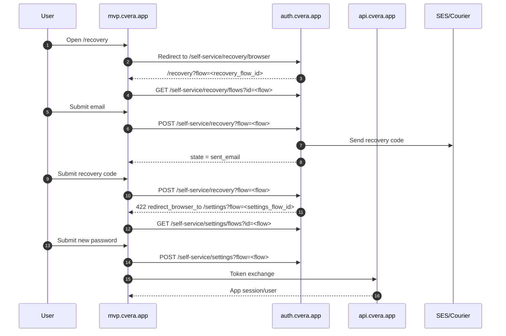

# Auth QA Checklist

Purpose: verify that Cvera authentication is stable after changes to Kratos browser recovery, settings continuation, token exchange, and Expo web routing.

## Scope

This checklist covers the MVP authentication path:

- Fresh user registration
- Existing user login
- Forgot password
- Recovery code
- Password reset
- Token exchange
- Logout
- Refresh while authenticated
- Refresh while unauthenticated
- Expired recovery flow

## Pre-Test Setup

- Use a clean browser session or incognito window.
- Open DevTools → Network.
- Filter for:
  - `self-service`
  - `sessions`
  - `auth/token-exchange`
  - `recovery`
  - `settings`
- Confirm deployed frontend is current.
- Confirm Kratos is using the expected config:
  - `recovery.ui_url = https://mvp.cvera.app/recovery`
  - `settings.ui_url = https://mvp.cvera.app/settings`

## Expected Flow Diagram



## QA Checklist

| Area | Test | Expected Result | Pass/Fail | Notes |
|---|---|---|---|---|
| Fresh user registration | Register a new user with a valid email and password. | Account is created or user is safely directed to sign in. No raw Kratos error leaks to user. |  |  |
| Existing user login | Sign in with a known valid user. | User reaches the correct authenticated app route. |  |  |
| Forgot password | Open `/recovery` with no `flow` query param. | Browser redirects through Kratos recovery and returns to `/recovery?flow=<id>`. |  |  |
| Browser recovery isolation | Watch Network during web recovery. | Web does **not** call `/self-service/recovery/api`. |  |  |
| Recovery email submit | Submit a valid email. | Safe message appears: “If that email exists…” and no account enumeration occurs. |  |  |
| Recovery code email | Check Mailinator/test inbox. | Email arrives from `auth@cvera.app` with recovery code. |  |  |
| Code-entry UI | After email submit, inspect UI. | Recovery code input and Continue button appear. Resend appears only when Kratos supports it. |  |  |
| Recovery code submit | Submit the received code. | Kratos returns 422 with `redirect_browser_to`, and browser navigates to `/settings?flow=<id>`. |  |  |
| Password reset | Submit a new password on `/settings`. | Password update succeeds and user can proceed/sign in. |  |  |
| Token exchange | Watch console/network after successful password reset or login. | App token exchange succeeds and user hydrates into authenticated app state. |  |  |
| Logout | Click Log out. | User returns to unauthenticated state and protected app routes are inaccessible. |  |  |
| Refresh while authenticated | Refresh browser while logged in. | App restores authenticated state without showing a permanent logout/session screen. |  |  |
| Refresh while unauthenticated | Log out, then refresh. | App remains unauthenticated and shows login/auth entry point. |  |  |
| Expired recovery flow | Reuse an old `/recovery?flow=<id>` or wait for expiry. | UI shows clear restart path. Web does not fall back to API recovery. |  |  |
| Expired settings flow | Reuse an old `/settings?flow=<id>`. | UI shows clear restart/recovery guidance. |  |  |
| Direct URL refresh | Refresh `/login`, `/register`, `/recovery`, `/settings`, `/verify`, `/error`. | Vercel SPA routing resolves to the app, not a 404. |  |  |

## Critical Acceptance Checks

These are the non-negotiable pass conditions before treating auth as MVP-stable:

- Web recovery never calls `/self-service/recovery/api`.
- Recovery email submission does not reveal whether the account exists.
- Recovery code submission redirects to `https://mvp.cvera.app/settings?flow=<id>`, not Ory fallback docs.
- New password works after reset.
- Old password fails after reset.
- Token exchange succeeds after authentication.
- Existing Login/Register behavior remains unchanged.
- Expired recovery/settings flows fail safely with a restart path.

## Known Normal Behavior

A `422 Unprocessable Content` response after recovery code submission is expected when Kratos returns `redirect_browser_to`.

Expected sequence:

```text
POST /self-service/recovery?flow=<id> → 422
redirect_browser_to → https://mvp.cvera.app/settings?flow=<settings_flow_id>
```

This is not a failed recovery if the redirect occurs.

## Suggested Regression Cadence

Run this checklist:

- Before merging auth-related changes.
- After changing Kratos config.
- After changing Vercel routing.
- Before demos.
- Before native auth work touches shared auth state.
