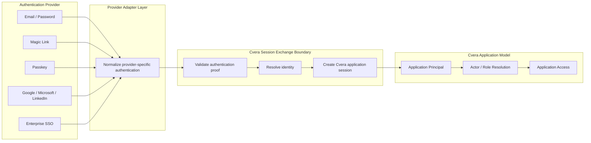

# Canonical Authentication Session Model

**Document:** `docs/auth/canonical-auth-session-model.md`
**System:** Cvera / EVT
**Status:** Architectural Baseline
**Audience:** Identity Architects, Security Architects, Platform Engineers, Application Engineers

---

# 1. Purpose

This document defines the canonical authentication and session model for Cvera.

Its purpose is to establish a provider-neutral architecture that remains stable regardless of how a user authenticates.

The document defines:

* authentication concepts
* identity boundaries
* session semantics
* trust boundaries
* principal resolution
* authorization relationships
* future provider integration requirements

The objective is to ensure that all present and future authentication methods normalize into a single Cvera session model.

---

# 2. Relationship To Authentication Contract

This document complements the Authentication & Session Contract.

## This Document Owns

* conceptual authentication architecture
* identity layers
* canonical session semantics
* trust boundaries
* principal resolution model
* provider-neutral integration model
* authorization relationships
* future provider integration requirements
* architectural invariants

## Authentication Contract Owns

* deployment topology
* infrastructure architecture
* Docker configuration
* Kratos configuration
* endpoint definitions
* token formats
* token lifetimes
* refresh token implementation
* browser/native flow implementation
* operational security controls
* implementation-specific behavior

## Architectural Rule

The Authentication Contract explains **how** authentication is implemented.

This document defines **what authentication means inside Cvera**.

If implementation details change while preserving the same session semantics, this document remains authoritative.

---

# 3. Scope

This document applies to:

* browser authentication
* native authentication
* current authentication providers
* future authentication providers
* application session creation
* identity resolution
* authorization resolution

This document does not define:

* MFA architecture
* passkey architecture
* OIDC architecture
* SAML architecture
* enterprise SSO architecture
* provider-specific implementation details

Those capabilities must conform to the model defined here.

---

# 4. Core Principles

## Principle 1 — Authentication Is Not Authorization

Authentication proves control of an identity.

Authorization determines what that identity may do within Cvera.

These concerns remain separate.

---

## Principle 2 — Provider Independence

Authentication providers are interchangeable.

Application session semantics are not.

No authentication provider may alter the Cvera session model.

---

## Principle 3 — Session Uniformity

Every authenticated application session must be created through the same session exchange process.

A user authenticated through a password, passkey, magic link, or enterprise provider must ultimately receive the same application session type.

---

## Principle 4 — Explicit Trust Boundaries

Authentication proof must be validated before application access is granted.

Trust does not cross boundaries automatically.

Every boundary transition must be explicit.

---

## Principle 5 — Identity Before Authority

Authentication establishes identity.

Identity resolves to a Cvera principal.

Authority is derived from the principal.

Authority is never derived directly from an authentication provider.

---

# 5. Identity Layers

Cvera separates identity into three distinct layers.

## Layer 1 — Authentication Identity

The Authentication Identity is owned by an authentication provider.

Examples include:

* Kratos identity
* Google account
* Microsoft account
* Enterprise directory account
* Passkey-bound identity

Responsibilities:

* credential ownership
* authentication proof
* identity verification

This layer answers:

> "Who successfully authenticated?"

---

## Layer 2 — Cvera Application Principal

The Cvera Application Principal is the canonical identity recognized by Cvera.

Responsibilities:

* application ownership
* session ownership
* account linkage
* authorization anchor

This layer answers:

> "Who is this user inside Cvera?"

The Application Principal exists independently of any authentication provider.

---

## Layer 3 — Domain Actor

A Domain Actor represents authority within a specific domain.

Examples:

* Requestor
* HR Reviewer
* Recruiter
* Administrator
* Future domain-specific actors

Responsibilities:

* permissions
* workflow participation
* policy evaluation

This layer answers:

> "What authority does this principal currently possess?"

---

# 6. Canonical Session Model

All authentication methods must normalize into the following model:

```text
Authentication Proof
        ↓
Identity Resolution
        ↓
Cvera Session Exchange
        ↓
Application Principal
        ↓
Actor Resolution
        ↓
Application Access
```

This sequence defines the canonical Cvera authentication lifecycle.

No alternative lifecycle is permitted.

---

## Canonical Flow

### Step 1

Authentication provider produces authentication proof.

### Step 2

Authentication proof resolves an Authentication Identity.

### Step 3

Authentication Identity resolves a Cvera Application Principal.

### Step 4

Application Principal undergoes Session Exchange.

### Step 5

Session Exchange creates Cvera application session tokens.

### Step 6

Application Principal resolves active actors and permissions.

### Step 7

Authorized application access is granted.

---

# 7. Current Implemented Model

The current implementation conforms to the canonical model.

## Registration

Creates a provider-managed authentication identity.

No application session is created.

---

## Email Verification

Confirms ownership of an email address.

No application session is created solely because verification succeeds.

---

## Login

Produces authentication proof.

Authentication proof establishes an authenticated identity.

Authentication alone does not create a Cvera application session.

---

## Password Recovery

Initiates identity recovery.

Recovery does not create an authenticated application session.

---

## Password Reset

Allows credential replacement.

Password reset does not create an authenticated application session.

---

## Token Exchange

Validated authentication proof is exchanged into:

* Cvera access token
* Cvera refresh token

This creates the application session.

---

## Refresh

Refresh extends an existing Cvera session.

Refresh does not re-authenticate the user.

---

## Logout

Logout destroys the active Cvera session.

Subsequent application access requires a new authentication proof and session exchange.

---

# 8. Session Exchange Boundary

The Session Exchange boundary is the canonical trust boundary of the system.

```text
Authentication Provider
        ↓
Session Exchange Boundary
        ↓
Cvera Application Session
```

The exchange boundary exists to ensure:

* provider independence
* consistent session semantics
* centralized authorization
* future extensibility

Authentication providers establish identity.

Only Session Exchange may establish application access.

## Canonical Authentication Normalization Model

*Illustration: how all current and future authentication providers normalize into a single Cvera application-session model through the Session Exchange boundary.*



---

## Trust Boundary Rule

Authentication proof may cross into Cvera.

Authorization may not originate outside Cvera.

---

# 9. Provider-Neutral Adapter Model

Authentication providers integrate through adapters.

An adapter translates provider-specific authentication into canonical authentication proof.

```text
Provider
    ↓
Provider Adapter
    ↓
Authentication Proof
    ↓
Identity Resolution
    ↓
Session Exchange
    ↓
Cvera Session
```

The adapter layer prevents provider-specific behavior from leaking into application session semantics.

---

## Adapter Responsibility

Adapters may:

* validate provider authentication
* resolve provider identity
* normalize provider claims

Adapters may not:

* create application sessions
* assign application permissions
* assign application roles
* bypass session exchange

---

# 10. Future Provider Categories

The following categories are expected to integrate with the model.

## Password Credentials

Examples:

* email/password

Produces authentication proof.

---

## Passwordless Methods

Examples:

* magic links
* passwordless email flows

Produces authentication proof.

---

## Passkeys

Examples:

* passkeys
* WebAuthn credentials

Produces authentication proof.

---

## Federated Identity Providers

Examples:

* Google
* LinkedIn
* OIDC providers

Produces authentication proof.

---

## Enterprise Identity Providers

Examples:

* Microsoft Entra ID
* enterprise SSO systems
* future corporate identity providers

Produces authentication proof.

---

## Architectural Requirement

All provider categories must terminate at the same Session Exchange boundary.

---

# 11. Account Linking Model

A single Application Principal may be associated with multiple Authentication Identities.

Examples:

```text
Application Principal
 ├── Email/Password Identity
 ├── Google Identity
 ├── Microsoft Identity
 └── Future Passkey Identity
```

The Application Principal remains authoritative.

Authentication providers remain attached identities.

Application ownership does not migrate between providers.

---

## Account Linking Goal

Authentication methods should be additive.

Adding a provider should not create a new Application Principal unless explicitly intended.

---

# 12. Authorization Model

Authorization is resolved after Session Exchange.

Authorization depends on:

* Application Principal
* Actor assignments
* Policy evaluation
* Domain context

Authorization must not depend on:

* authentication provider
* credential type
* provider-specific claims alone

The same user must receive equivalent authorization regardless of how they authenticated.

---

# 13. Design Invariants

The following statements are normative.

## Session Creation

A Cvera application session MUST be created through Session Exchange.

A provider MUST NOT create application sessions directly.

---

## Identity Resolution

Authentication identities MUST resolve to an Application Principal before authorization occurs.

---

## Authorization

Authorization MUST be based on Application Principals and Actors.

Authorization MUST NOT be based solely on authentication providers.

---

## Provider Independence

Authentication providers MUST remain replaceable.

Provider-specific session semantics MUST NOT exist.

---

## Recovery

Recovery flows MUST NOT automatically create authenticated application sessions.

---

## Verification

Verification flows MUST NOT automatically create authenticated application sessions.

---

## Account Linking

Multiple authentication identities MAY resolve to a single Application Principal.

---

## Trust Boundary

Session Exchange MUST remain the canonical trust boundary.

No provider integration may bypass it.

---

# 14. Provider Readiness Checklist

A future authentication provider is considered architecturally compatible when it can answer "yes" to all of the following:

* Can the provider produce authentication proof?
* Can the provider identity be resolved deterministically?
* Can the identity map to a Cvera Application Principal?
* Can the provider terminate at Session Exchange?
* Can authorization remain provider-independent?
* Can account linking be supported?
* Can existing session semantics remain unchanged?
* Can existing token semantics remain unchanged?
* Can the provider operate without bypassing trust boundaries?

If any answer is "no", the provider requires architectural review.

---

# 15. Recommended Evolution Path

The recommended evolution path is:

### Phase 1

Current implementation:

* registration
* verification
* login
* recovery
* reset
* token exchange
* refresh
* logout

---

### Phase 2

Additional authentication proofs:

* passwordless methods
* passkeys
* federated providers

---

### Phase 3

Enterprise integrations:

* OIDC
* enterprise SSO
* corporate identity systems

---

### Phase 4

Advanced identity linking and governance capabilities.

All future phases must preserve:

* Session Exchange
* Application Principal authority
* provider neutrality
* authorization independence

---

# 16. Open Questions

The following topics intentionally remain unresolved:

1. Long-term Application Principal identifier strategy.
2. Canonical account-linking lifecycle and governance model.
3. Future delegated identity and holder/wallet relationships.
4. Actor assignment lifecycle management.
5. Future authorization policy architecture.
6. Cross-domain principal relationships.
7. Identity portability beyond authentication providers.
8. Future revocation and account recovery governance models.

These questions may evolve independently without changing the canonical session model defined in this document.

---

# Summary

The canonical Cvera authentication model is:

```text
Authentication Proof
    ↓
Identity Resolution
    ↓
Cvera Session Exchange
    ↓
Application Principal
    ↓
Actor Resolution
    ↓
Application Access
```

Authentication providers may evolve.

Authentication technologies may evolve.

Authentication implementations may evolve.

The Session Exchange boundary, Application Principal model, and authorization semantics remain stable.
